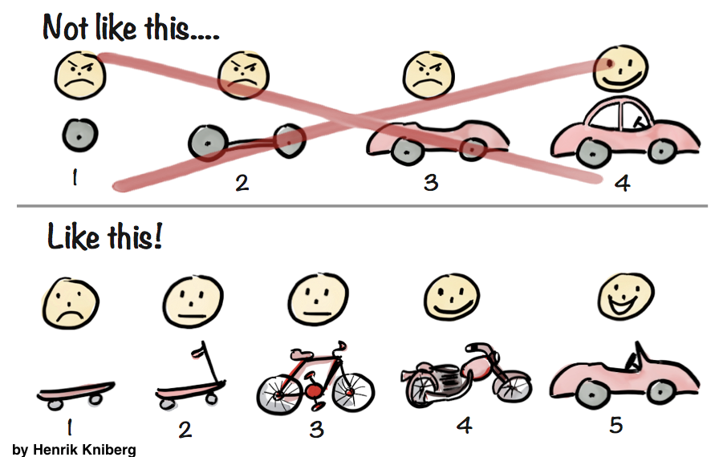

PS2: Multiple Regression
================

What's due when?
----------------

By Friday 2/14 at 9am you must:

1.  Submit all your work (see next section) on GitHub. Any teams making submissions with timestamps after the above due date/time will be penalized 25% per day.

Your work
---------

Participate in Kaggle's [House Prices: Advanced Regression Techniques](https://www.kaggle.com/c/house-prices-advanced-regression-techniques/), where among other things you will:

1.  Fit a multiple regression model involving exactly three numerical and three categorical variables.
2.  Justify why you chose these 6 variables and justify why you omitted others.
3.  Apply the fitted/trained model to the training data and compute the root mean squared logarithmic error using `dplyr` and other R functions. In other words, do not use a `rmsle()` function from another R package.
4.  Write a `submissions.csv` file that when submitted on Kaggle, returns a valid score.
5.  Take a screenshot of your Kaggle score and compare it to the score you computed earlier.

Suggested workflow
------------------

-   Knit `PS2.Rmd` and read all instructions.
-   Before doing any modeling, perform an exploratory data analysis:
    -   Read the data dictionary included in `data/data_description.text` and get familiar with all variables
    -   Look at the raw data values in RStudio's spreadsheet viewer
    -   Compute summary statistics
    -   Create data visualizations
-   Take the "minimally viable product" approach to model building. Remember, done is better than perfect.

Evaluation criteria
-------------------

1.  **"If others can't reproduce your work, they will throw it in the trash."** Submissions that don't knit will be penalized harshly. Hints to prevent this from happening:
    -   Knit early, knit often.
    -   Make sure you can knit `PS2.Rmd` files locally.
2.  **"Presentation and communication-style matters."** Related to point above, for example
    -   Don't include superfluous output that the reader doesn't need, doesn't care about, or can't digest.
    -   All things being equal, readers prefer concise and crisp written explanations, rather than overly long ones.
    -   Plots: Keep the "ink-to-information" ratio in mind. Ensure your plots have labeled axes and informative titles.
    -   Use markdown formatting to make your presentation effective.
    -   Is code cleanly written, well-documented, and well-formatted.
3.  **"Did you only do what you were told, or did you try to be creative?"** For example:
    -   Creativity in choice of variables and transformations.
    -   Creativity in modeling approach
